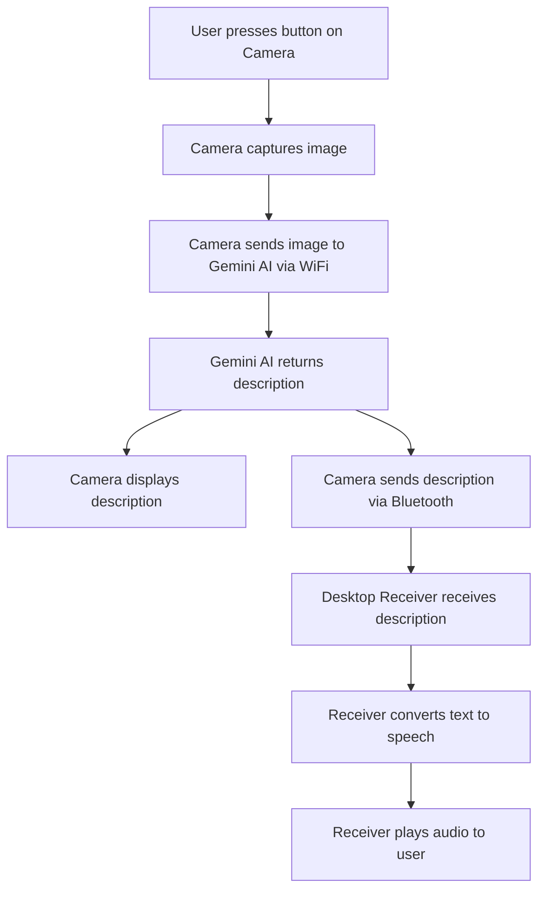

# Memento Cognitio

Memento Cognitio is a hardware-software system designed to capture images, analyze them using AI, and deliver concise spoken descriptions via Bluetooth. The project consists of firmware for Adafruit MEMENTO Camera Board and a Python-based Bluetooth receiver for desktop use.

---

## Features

- **Image Capture:** Use on-board buttons to capture images.
- **AI Analysis:** Images are sent to Gemini AI for analysis and description.
- **Bluetooth Communication:** Descriptions are transmitted to a paired desktop receiver.
- **Text-to-Speech:** The receiver converts received text to speech using PiperVoice.
- **Multiple Modes:** Different prompts for various analysis modes (object listing, mood, tool usage, OCR, image description).

---

## Project Structure

```
firmware/
  ├── code.py                # Main firmware logic for ESP32S3 Camera
  ├── constants.py           # Prompt modes and constants
  ├── settings.example.toml  # Example settings file
  ├── splash.bmp             # Logo splash screen
  ├── lib/                   # manually installed libraries
  └── manager/               # scripts for managing llm, buzzer, bluetooth and wifi    
bt-receiver/
  └── main.py                # Python Bluetooth receiver for TTS
```

---

## Setup

### Hardware

- **Adafruit Memento Camera Board** flashed with CircuitPython.
- Ensure `code.py`, `constants.py`, and `settings.toml` are on the device.

### Firmware Configuration

1. Edit `firmware/settings.toml` with your WiFi SSID, password, and Gemini API key.
2. Flash the firmware files to your Adafruit MEMENTO Camera Board.

### Desktop Receiver

1. Install Python 3.12.
2. Install dependencies:
   ```bash
   pip install bleak pydub piper
   ```
3. Place `bt-receiver/main.py` in your working directory.
4. Ensure the Piper TTS model (`tts_models/en_US-libritts_r-medium.onnx`) is present.

---

## Usage

### On the Camera

- Power on the device.
- Wait for BLE connection and WiFi setup.
- Use hardware buttons to capture images and select analysis modes.

### On the Desktop

- Run the receiver:
  ```bash
  python bt-receiver/main.py
  ```
- The receiver will scan for the camera, connect, and play received descriptions as speech.

---

## Prompt Modes

| Button   | Prompt Description                                     |
|----------|--------------------------------------------------------|
| Shutter  | Brief description in 20 words or less                  |
| Up       | List objects/items in the image                        |
| Down     | Describe mood/atmosphere                               |
| Left     | Explain usage of item/tool                             |
| Right    | Creative story based on image                          |
| Select   | Identify visible text (Perform OCR)                    |
| OK       | Main subject/focus of image                            |

---

## Project Flow



---

## Troubleshooting

- **Camera not found:** Ensure it is powered on and within Bluetooth range.
- **WiFi issues:** Double-check credentials in `settings.toml`.
- **TTS issues:** Confirm Piper model file is present and compatible.

---

## License

This project falls under the MIT License. Read [LICENSE](./LICENSE) to know more.

---

## Contact

For questions or contributions, please open an issue or [mail](mailto:arpitsengar99@gmail.com) to me.